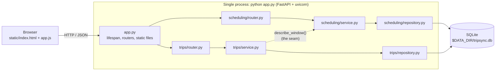
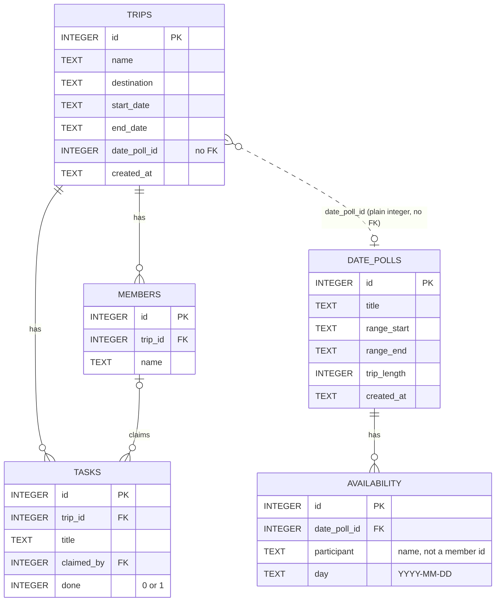

# TripSync

Planning trips with friends, without the group-chat chaos.

## The problem
Group trips usually die at the first question: *when can everyone actually go?*
Availability gets scattered across group chats, decisions never get closed,
and nobody knows who is handling what.

## What TripSync does
The app is split into two independent feature domains, served by one process.

### 1. Scheduling (deciding when)
- Create a date poll: a date range and a trip length (e.g. 3 days in October).
- Each friend marks the days they're free on an interactive calendar.
- The app ranks every possible window by **how many people can attend the whole trip**,
  then by **fewest missed days** among those who can't, then by **earliest start**.

### 2. Trips (organizing)
- A trip with its members and destination.
- A task board: members claim tasks ("book accommodation", "rent car") and mark them done,
  with a progress summary.
- Confirm the trip's dates from a date-poll window.

### How they connect
Scheduling knows nothing about trips. Trips confirms its dates by calling one function in
the Scheduling **service layer** (`describe_window`), never its tables. Each domain owns its
own code, router and tables, with no foreign keys between them, so they can later be split
into separate services. See `ADR.md` (entries 2 and 3).

## Architecture



## Database schema



Scheduling owns `date_polls` and `availability`; Trips owns `trips`, `members` and `tasks`.
Foreign keys exist only **within** a domain. The dashed line is a plain integer reference, not
a foreign key (ADR-3).

## Setup

Requires **Python 3.12+** (developed and tested on Python 3.14).

```bash
git clone https://github.com/TheAleZap/devops_assignment_1.git
cd devops_assignment_1
python3 -m venv .venv
source .venv/bin/activate        # Windows: .venv\Scripts\activate
pip install -r requirements.txt
```

## Run

```bash
python app.py
```

Then open **http://localhost:8000**. Interactive API docs are at **http://localhost:8000/docs**.
No manual setup is needed: the data folder, database file and tables are created
automatically at startup.

## Configuration

Everything is configured through environment variables. No `.env` file is required.

| Variable | Default | Purpose |
|---|---|---|
| `PORT` | `8000` | Port the server listens on (always binds to `0.0.0.0`) |
| `DATA_DIR` | `data` | Folder for the SQLite file; the database lives at `$DATA_DIR/tripsync.db` |

Example: `PORT=9000 DATA_DIR=/tmp/tripsync python app.py`

## API

| Method | Endpoint | Purpose |
|---|---|---|
| GET | `/health` | Liveness check |
| POST | `/api/scheduling/polls` | Create a date poll |
| GET | `/api/scheduling/polls/{id}` | A poll with everyone's availability |
| PUT | `/api/scheduling/polls/{id}/availability` | Replace one participant's free days |
| GET | `/api/scheduling/polls/{id}/best-windows?limit=5` | Ranked date windows |
| POST | `/api/trips` | Create a trip (optionally with members) |
| GET | `/api/trips/{id}` | A trip with members, tasks and progress |
| POST | `/api/trips/{id}/members` | Add a member |
| POST | `/api/trips/{id}/tasks` | Add a task |
| POST | `/api/trips/{id}/tasks/{task_id}/claim` | A member claims a task |
| POST | `/api/trips/{id}/tasks/{task_id}/complete` | Mark a claimed task done |
| PUT | `/api/trips/{id}/dates` | Confirm trip dates from a date-poll window |

## Tests and coverage

```bash
python -m pytest --cov=scheduling --cov=trips --cov-report=term-missing
```

Result: **40 tests passing, 76% total coverage.** Every service and repository module is at
100%; the routers are untested by design and were verified manually (see ADR-4).

Use `python -m pytest` rather than plain `pytest`, so the pytest inside the virtual environment
(with the coverage plugin) is the one that runs.

## Project structure

```
app.py, config.py, db.py     entry point, configuration, SQLite connections
scheduling/                  router.py, service.py, repository.py
trips/                       router.py, service.py, repository.py
static/                      index.html, app.js, style.css
tests/                       conftest.py, test_scheduling_service.py, test_trips_service.py
```

## Out of scope
- General polls for destination or activities (see ADR-5)
- Day-by-day itinerary
- User accounts / login
- Payments or expense splitting
- Chat, maps, or booking integrations

## Process documentation
- `ADR.md`: the five architecture decisions, logged as they were made
- `AI_USAGE.md`: a log of every meaningful AI interaction and how the resulting code works
